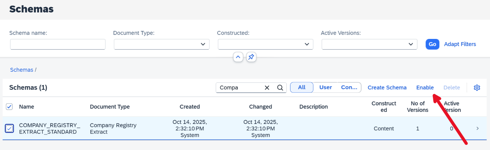
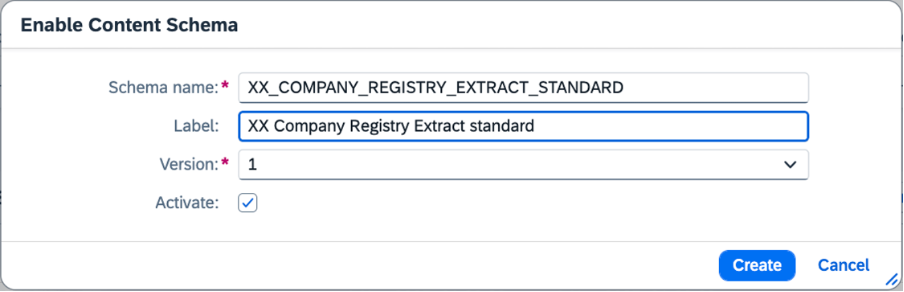
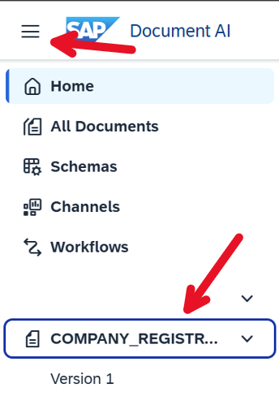
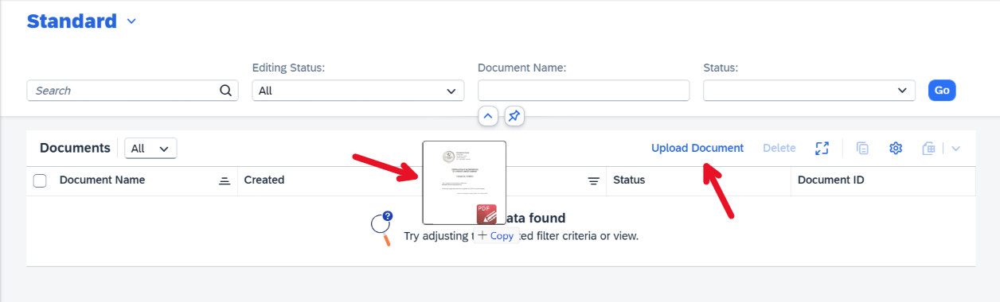
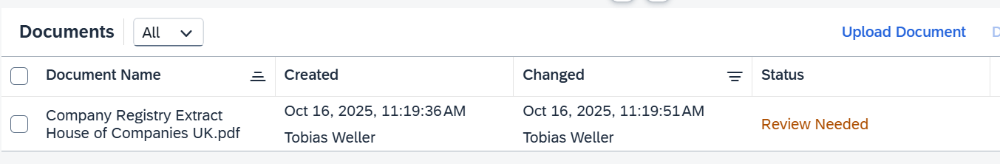
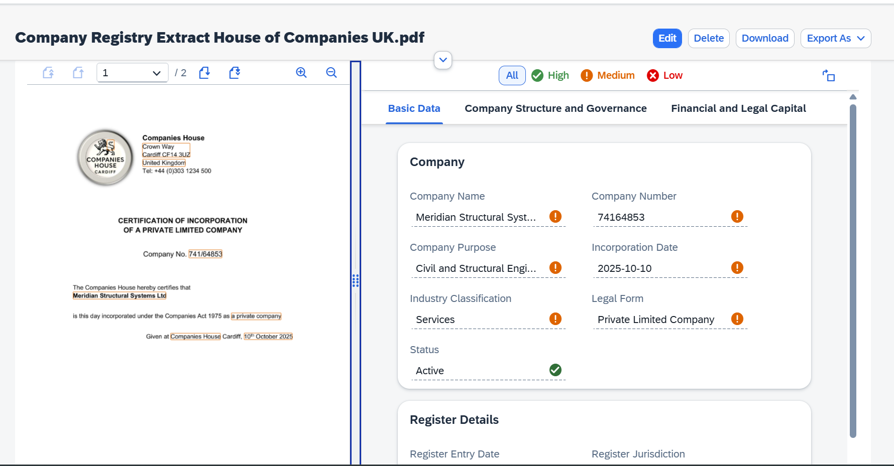

# Exercise 1 - Activate a content schema and upload your first document

In this exercise, we will activate a content schema and upload our first document for processing.
A schema describes the structure of the information that we want to extract from a document and contains processing instructions as well as visualization-related configurations.
Document processing is always based on schema, as part of the application, we deliver a number of content schemas, as a way to quickly start using the application for processing of various common document types.

## Exercise 1.1 Activate a content schema 

After completing these steps you will have activated your first schema.

1. In the home screen of SAP Document AI, click on "My Schemas".  

2. In the Schema overview page, search for "COMPANY_REGISTRY_EXTRACT_STANDARD". Select the checkbox and click on "Enable".  

3. In the dialog, select version "1", and mark the checkbox "Activate" and click "Create". This will create a copy of the content and activate it so that you can use the schema afterwards for document processing. 
  Make sure to ***replace "XX" with your Prefix*** assigned to you. e.g. A35_COMPANY_REGISTRY_EXTRACT_STANDARD | A35 Comapny Registry Extract Standard
 

## Exercise 1.2 Upload your first document

After completing these steps you will have uploaded and reviewed your first document.

1. Once you created your own schema in step 3. of the previous exercise, a new menu icon will appear in the navigation pane on the right. Click on it and select "Version 1".  

2. Now you reached the Worklist of your "COMPANY_REGISTRY_EXTRACT_STANDARD" schema. This list will show all documents that got processed with this schema. 
Since we haven't uploaded a document yet, the list is still empty. To start the processing, upload a document by clicking "Upload" or dragging and dropping a file into the Worklist. Pick the file ["Company Registry Extract House of Companies UK.pdf"](../documents/Company%20Registry%20Extract%20House%20of%20Companies%20UK.pdf) and upload it  

3. After the upload a new entry should appear in the Worklist. Wait a few seconds until the status changes to "Review Needed"
 

4. Click on the document in the Worklist to review the extracted information
 

## Summary

You've now activated a first schema and processed a document with it. If you want to play around more, you can activate some of the other content schemas and upload documents of different types.

If you want to continue, learn how to configure the schema further in exercise 2 - [Exercise 2 - Schema configuration](../ex2/README.md)

---

## Navigation

| Topic | Duration | Link |
| --- | --- | --- |
| Exercise 0 - Getting Started | - | [/exercises/ex0](/exercises/ex0) |
| Exercise 1 - Activate a Content Schema and Upload your first document | 5 mins | [/exercises/ex1](/exercises/ex1) |
| Exercise 2 - Configure a Schema with Worklist and Object Page Header Entities | 5 mins | [/exercises/ex2](/exercises/ex2) |
| Exercise 3 - Add Custom Fields to the Schema | 5 mins | [/exercises/ex3](/exercises/ex3) |
| Exercise 4 - Review Documents and Automate the Review | 10 mins | [/exercises/ex4](/exercises/ex4) |
| Exercise 5 - Create a Custom Schema | 15 mins | [/exercises/ex5](/exercises/ex5) |
| Demo 6 - Use Instant Learning to improve extraction accuracy | 3 mins | [Instant Learning Demo Video](https://youtu.be/fOZsmAPaD9E) |
| Exercise 7 - Create a Document Workflow | 15 mins | [/exercises/ex7](/exercises/ex7) |
| Demo 8 - Email Ingestion with Channels | 1 min | [Email Ingestion Demo Video](https://youtu.be/2CFz59M6QkE) |
| Demo 9 - Document Scanning with SAP Mobile Start | 2 mins | [Document Scanning Demo Video](https://youtu.be/6zSnSLFhono) |