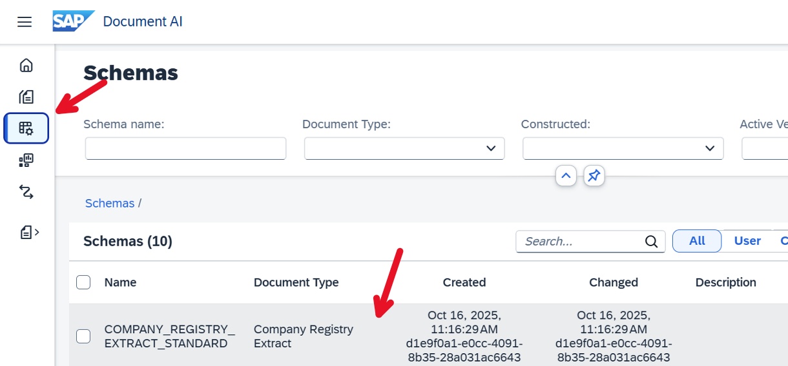
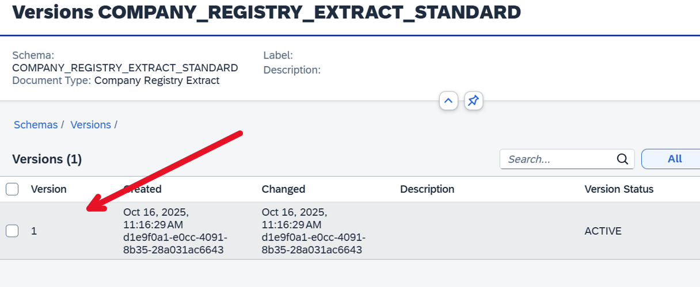
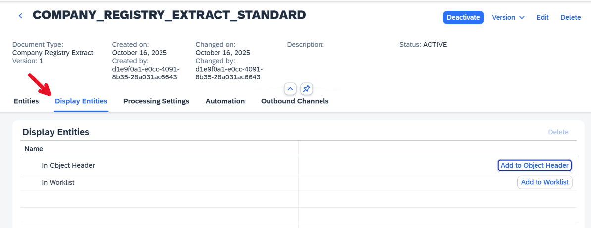
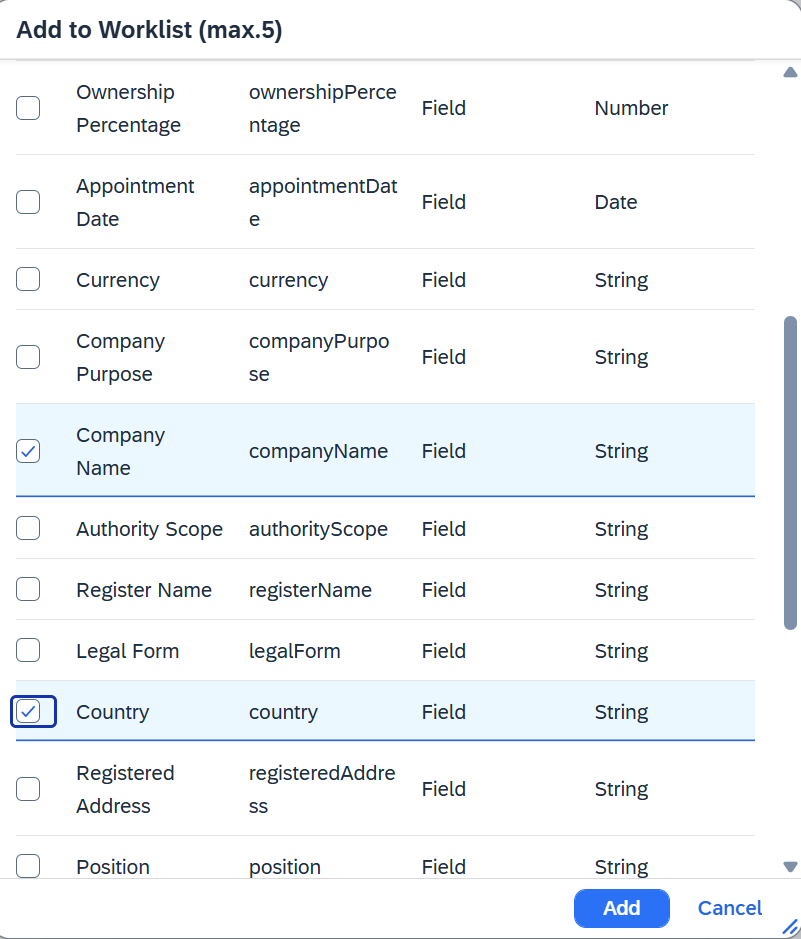
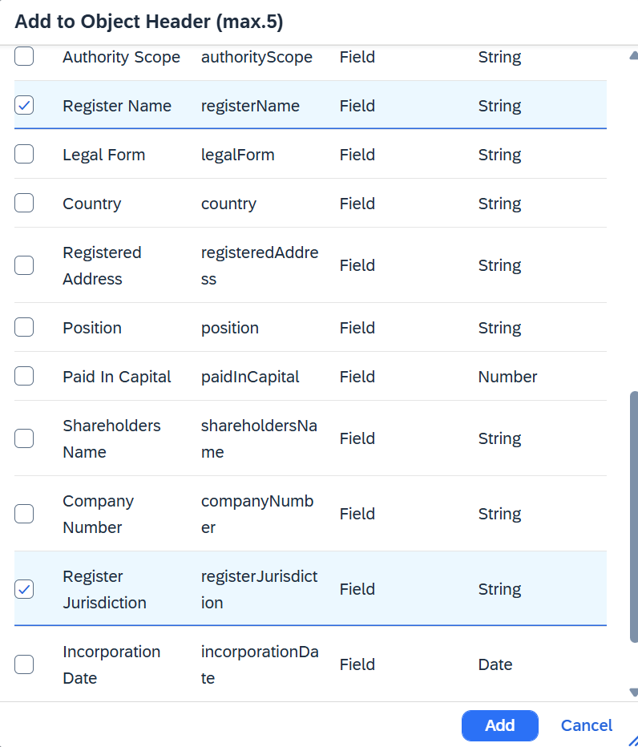
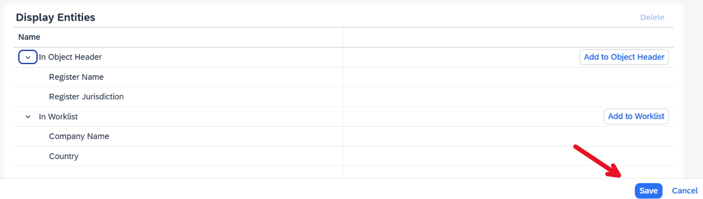
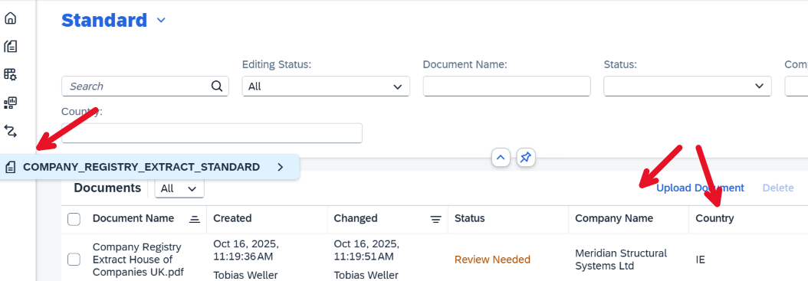
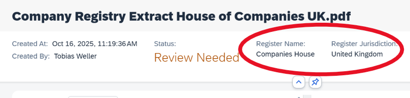

# Exercise 2 - Configure Worklist and Object Page Header Entities

Schemas define which information appears in the document Worklist and in each document’s object page header.
This configuration allows tailoring the user interface to specific business needs. For example, when processing invoices, displaying the supplier name and total amount in the Worklist can make locating the correct invoice faster.

This exercise configures these settings for the **Company Registry Extract** schema.

---

1. Navigate back to the schema UI by clicking on the schema icon in the navigation bar.  

2. Select **Version 1** to open the schema details.  

3. In the configuration screen, open the **Display Entities** tab.  

4. Configure the Worklist view. Click **Add to Worklist**, select several schema fields in the dialog, then click **Add** to confirm. 

5. Configure the object page header. Click **Add to Object Header**, select a few schema fields, ideally different from those added to the Worklist, and click **Add** to apply the changes. 

6. Confirm the changes by clicking "Save".  

7. Review the updated Worklist.
   Navigate back to the Worklist to verify that the selected fields appear. If not visible, refresh the browser window. 

8. Review the object page header.
   Open a document and check the header section to confirm that the selected fields appear as configured.  

## Summary

You have configured which fields appear in the document Worklist and in the object page header.

Continue to - [Exercise 3](../ex3/README.md)
