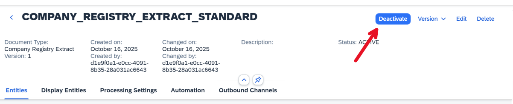
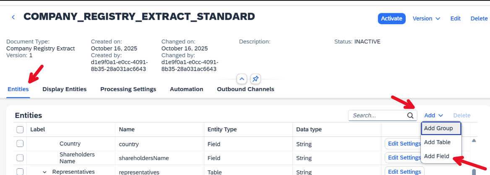
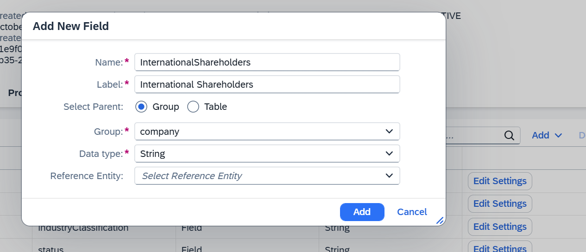
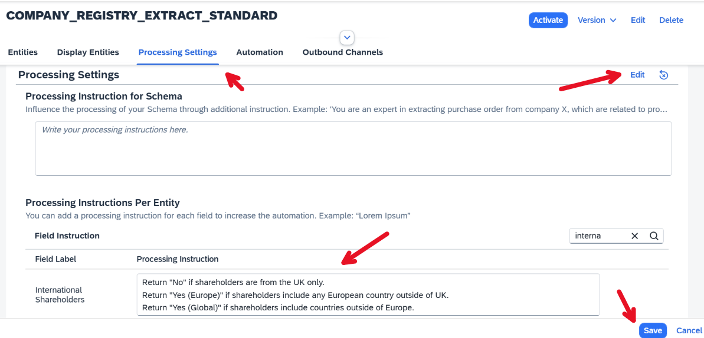
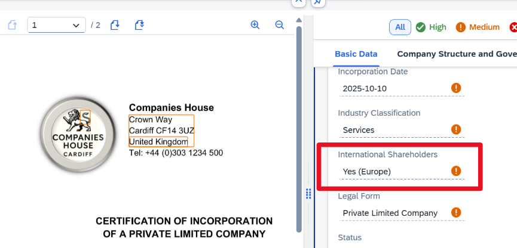

# Exercise 3: Add Custom Fields to the Schema

The current content schema lacks a field indicating whether a company has international shareholders.
In this exercise, a custom field will be added to extract that information automatically.

---

1. Open the schema screen, select **Version 1**, and click **Deactivate** to allow editing.  

2. To configure the custom field, go to the ***Entities*** tab, click on ***Add***, and select ***Add Field***.  

3. Fill the dialog with the information as shown in the image, and click on ***Add***.  
   
4. Finally, we want to configure dedicated processing instructions so that the field matches our use case. To do this, navigate to the ***Processing Settings*** tab and click on ***Edit***.
 Then search for our newly added field and fill the ***Processing Instructions*** of this field with the following text:

> Return ***No*** if shareholders are from the UK only. 
> Return ***Yes (Europe)*** if shareholders include any European country outside of UK. 
> Return ***Yes (Global)*** if shareholders include countries outside of Europe.

 

5. Once you are done, activate the schema again, navigate back to the Worklist and upload the document again. In the extraction results, search for the newly added field and validate if the value matches your expectation.
 

## Summary

You have added a custom field to the schema and configured it with tailored processing instructions.
You can either continue adding more fields or continue to - [Exercise 4](../ex4/README.md) to learn how to review documents and automate the review.

### Navigation

| Topic | Duration | Link |
| --- | --- | --- |
| Exercise 0: Getting Started | - | [/exercises/ex0/](/exercises/ex0/) |
| - Access the SAP Document AI User Interface | - | [/exercises/ex0#access-the-sap-document-ai-user-interface/](/exercises/ex0#access-the-sap-document-ai-user-interface) |
| - Access the Sample Documents | - | [/exercises/ex0#sample-documents](/exercises/ex0#sample-documents) |
| Exercise 1 - Activate a Content Schema and Upload your first document | 5 mins | [/exercises/ex1/](/exercises/ex1/) |
| Exercise 2 - Configure a Schema with Worklist and Object Page Header Entities | 5 mins | [/exercises/ex2/](/exercises/ex2/) |
| Exercise 3 - Add Custom Fields to the Schema | 5 mins | [/exercises/ex3/](/exercises/ex3/) |
| Exercise 4 - Review Documents and Automate the Review | 10 mins | [/exercises/ex4/](/exercises/ex4/) |
| Exercise 5 - Create a Custom Schema | 15 mins | [/exercises/ex5/](/exercises/ex5/) |
| Demo 6 - Use Instant Learning to improve extraction accuracy | 3 mins | [Instant Learning Demo Video](https://youtu.be/fOZsmAPaD9E) |
| Exercise 7 - Create a Document Workflow | 15 mins | [/exercises/ex7/](/exercises/ex7/) |
| Demo 8 - Email Ingestion with Channels | 1 min | [Email Ingestion Demo Video](https://youtu.be/2CFz59M6QkE) |
| Demo 9 - Document Scanning with SAP Mobile Start | 2 mins | [Document Scanning Demo Video](https://youtu.be/6zSnSLFhono) |