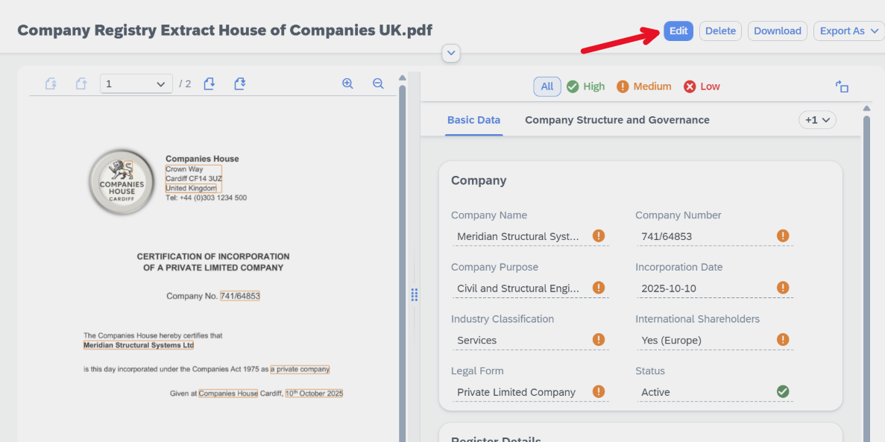
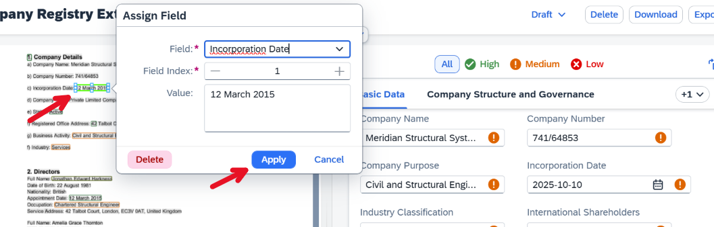
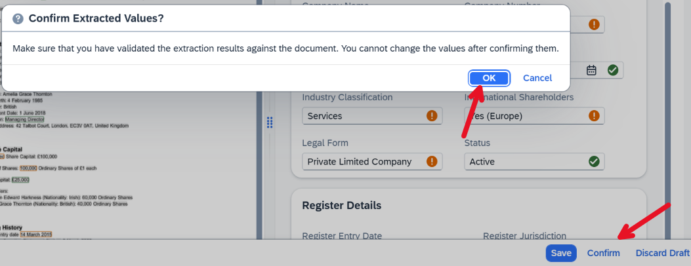
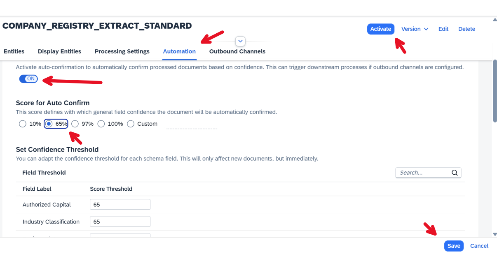
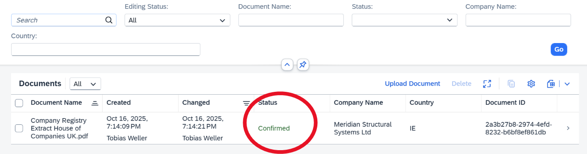

# Exercise 4 - Review Documents and Automate the Review

With the schema aligned to business requirements, it can now be used in production. During productive use, business users review extracted data, correct errors, and confirm documents to trigger downstream processes.

---

1. Open the **COMPANY_REGISTRY_EXTRACT_STANDARD** Worklist.
   If no documents are available, upload one before proceeding.
2. Once the document is in ***Review Needed*** state, open it, click on ***Edit*** to start reviewing the document  
3. Review the extracted fields and identify any incorrect values.
   For example, the incorporation date may have been extracted incorrectly.
   To correct a value, either type it manually or click on the correct value in the document preview, select the corresponding field, and apply it.
  
4. Once the document got reviewed and corrected, you can confirm it by clicking on the ***Confirm*** button. Confirming will mark the document as ready for downstream processes and will block further editing.
  

5. After consistent use, once extraction results are reliable, manual review can be reduced. This is done by configuring automatic confirmation based on AI confidence scores.
   Open the schema configuration for **COMPANY_REGISTRY_EXTRACT_STANDARD**.

6. Back to the schema screen, select **Version 1**, and click **Deactivate** to allow editing.   

7. Go to the ***Automation*** tab, activate ***auto-confirmation*** and select ***65%*** as confidence threshold. Before saving and activating the schema again. 
You can also play around with the confidence values or define confidence values only for some of the schema fields. 

8. Now back to the document **Schema Worklist of COMPANY_REGISTRY_EXTRACT_STANDARD** and **Upload the document** again. 
 You will see that the document does not go to ***Review Needed*** anymore but instead directly goes to ***Confirmed*** since all fields are above the confidence threshold.
  

---

## Summary

You have learned how to review documents, correct extraction errors, and configure automated confirmation based on AI confidence levels.
Continue to - [Exercise 5](../ex5/README.md)

---

## Navigation

| Topic | Duration | Link |
| --- | --- | --- |
| Exercise 0 - Getting Started | - | [/exercises/ex0](/exercises/ex0) |
| Exercise 1 - Activate a Content Schema and Upload your first document | 5 mins | [/exercises/ex1](/exercises/ex1) |
| Exercise 2 - Configure a Schema with Worklist and Object Page Header Entities | 5 mins | [/exercises/ex2](/exercises/ex2) |
| Exercise 3 - Add Custom Fields to the Schema | 5 mins | [/exercises/ex3](/exercises/ex3) |
| Exercise 4 - Review Documents and Automate the Review | 10 mins | [/exercises/ex4](/exercises/ex4) |
| Exercise 5 - Create a Custom Schema | 15 mins | [/exercises/ex5](/exercises/ex5) |
| Demo 6 - Use Instant Learning to improve extraction accuracy | 3 mins | [Instant Learning Demo Video](https://youtu.be/fOZsmAPaD9E) |
| Exercise 7 - Create a Document Workflow | 15 mins | [/exercises/ex7](/exercises/ex7) |
| Demo 8 - Email Ingestion with Channels | 1 min | [Email Ingestion Demo Video](https://youtu.be/2CFz59M6QkE) |
| Demo 9 - Document Scanning with SAP Mobile Start | 2 mins | [Document Scanning Demo Video](https://youtu.be/6zSnSLFhono) |