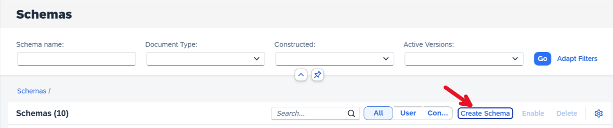
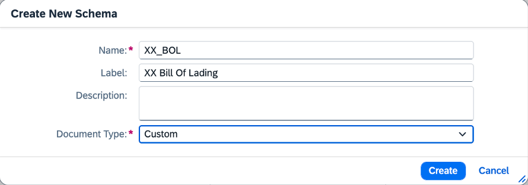
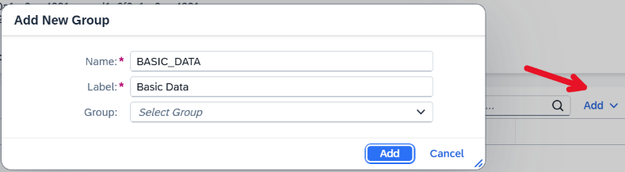
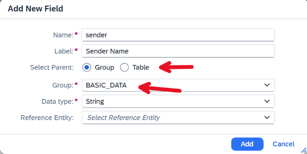
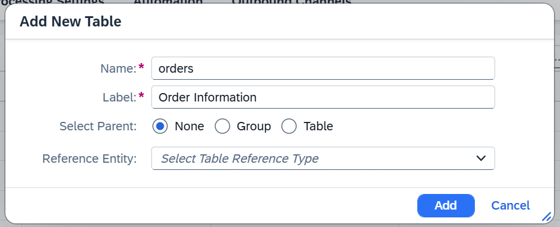
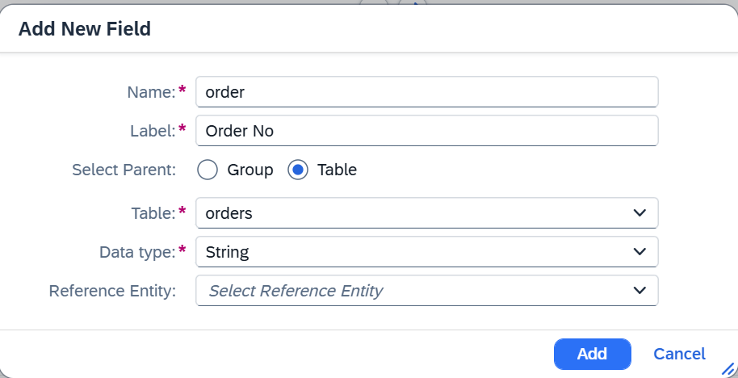
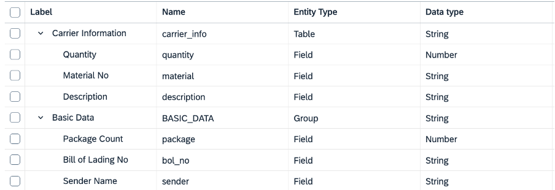
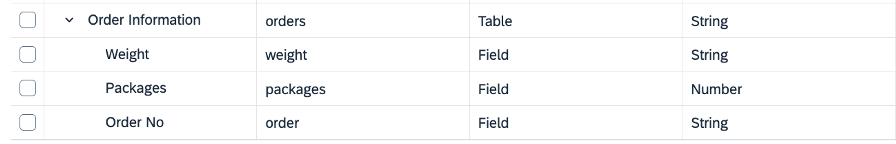
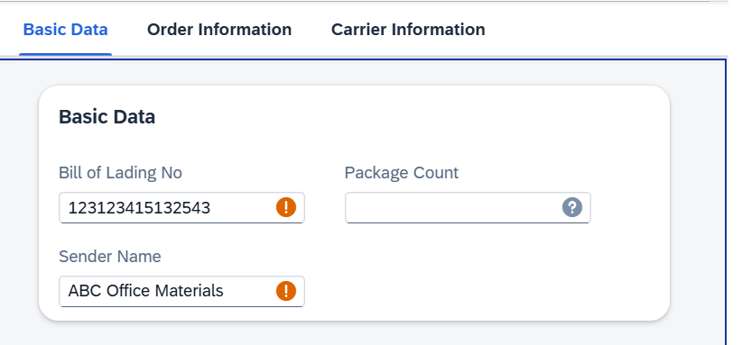
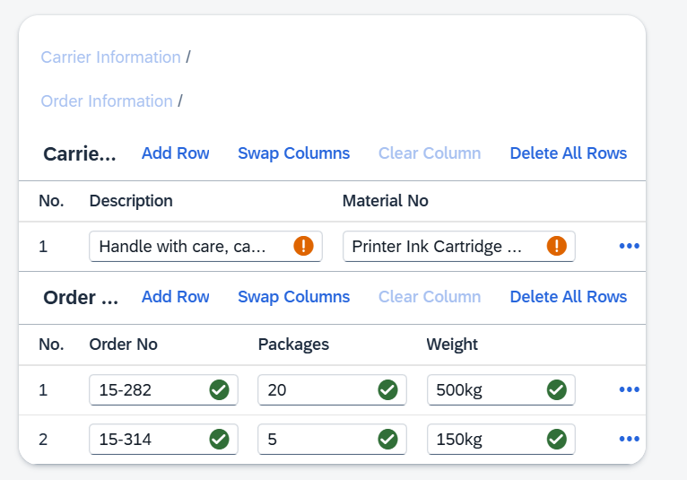

# Exercise 5 - Create a custom schema

In the following exercise, we want to process Bill of Lading documents. Since this document type is not yet covered by any of the SAP content schemas, we will create our own custom schema. 

1. To create the custom schema, go to the schema UI and click on "Create schema" 
2. In the dialog, fill out the mandatory information and set the Document Type to "Custom"   
3. Once the schema got created, click on it and then click on version 1 to open the schema details. In the details view, go to the "Entities" tab and click on "Add" and "Add Group". In the dialog add name and label as shown below 

4. Now click on "Add" again and select "Add Field". Fill out the mandatory information and make sure to set select parent to "Group" and select the previously created group. 

5. Now create a table by clicking on "Add" and "Add Table". 

6. Following this, add a field to the table by clicking "Add Field" and selecting the table as parent. 
7. Repeat this for all the entities shown in the table below, make sure to always select the correct parents (either the group or one of the two tables):
 
 

8. Once you maintained all the entities, activate the schema by clicking on "Activate". Then navigate to the Worklist of this schema and upload the document
   [Bill of Lading 1](../documents/Bill%20of%20Lading%201.pdf)
   
9. Once the document changed its status to "Review Needed", open it and check whether the extracted information matches what you defined in your schema 
 

---

## Summary

You have learned how to create a custom schema for a new document type.
confidence levels. 
Continue to [Instant Learning Demo Video](https://youtu.be/fOZsmAPaD9E) to learn how to improve accuracy with Instant Learning.

### Navigation

| Topic | Duration | Link |
| --- | --- | --- |
| Exercise 0 - Getting Started | - | [/exercises/ex0/](/exercises/ex0/) |
| Exercise 1 - Activate a Content Schema and Upload your first document | 5 mins | [/exercises/ex1/](/exercises/ex1/) |
| Exercise 2 - Configure a Schema with Worklist and Object Page Header Entities | 5 mins | [/exercises/ex2/](/exercises/ex2/) |
| Exercise 3 - Add Custom Fields to the Schema | 5 mins | [/exercises/ex3/](/exercises/ex3/) |
| Exercise 4 - Review Documents and Automate the Review | 10 mins | [/exercises/ex4/](/exercises/ex4/) |
| Exercise 5 - Create a Custom Schema | 15 mins | [/exercises/ex5/](/exercises/ex5/) |
| Demo 6 - Use Instant Learning to improve extraction accuracy | 3 mins | [Instant Learning Demo Video](https://youtu.be/fOZsmAPaD9E) |
| Exercise 7 - Create a Document Workflow | 15 mins | [/exercises/ex7/](/exercises/ex7/) |
| Demo 8 - Email Ingestion with Channels | 1 min | [Email Ingestion Demo Video](https://youtu.be/2CFz59M6QkE) |
| Demo 9 - Document Scanning with SAP Mobile Start | 2 mins | [Document Scanning Demo Video](https://youtu.be/6zSnSLFhono) |