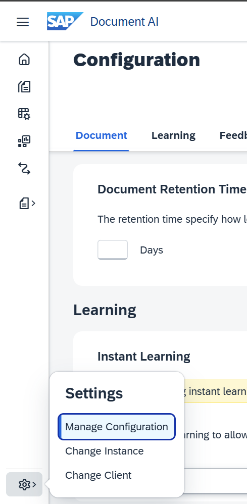
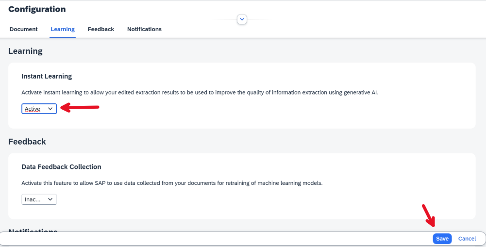
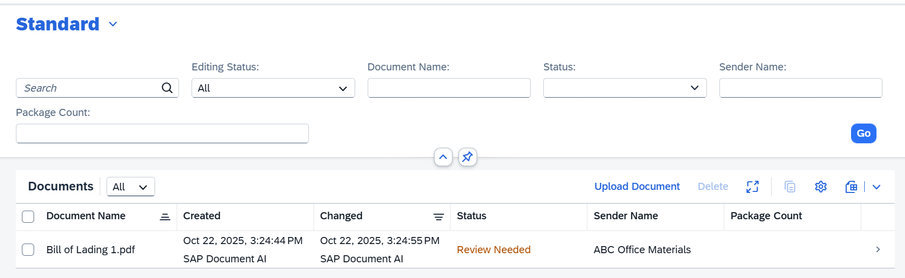
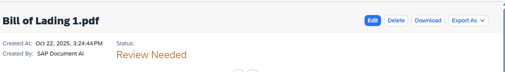
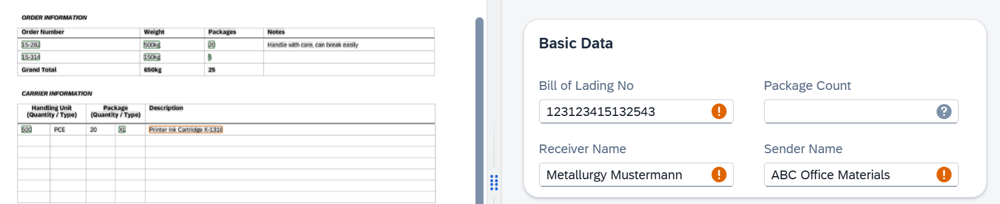
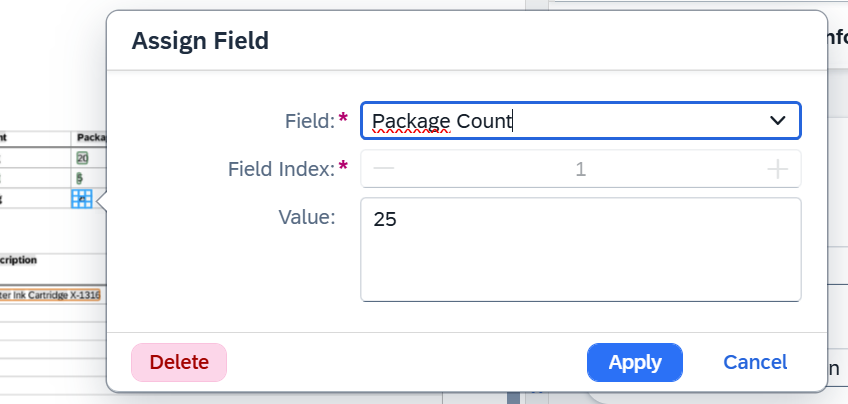
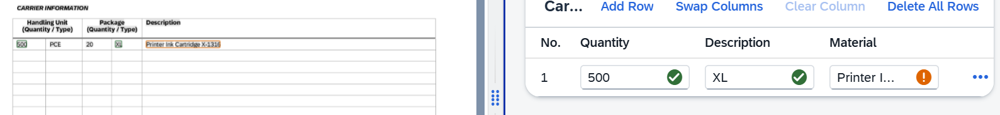
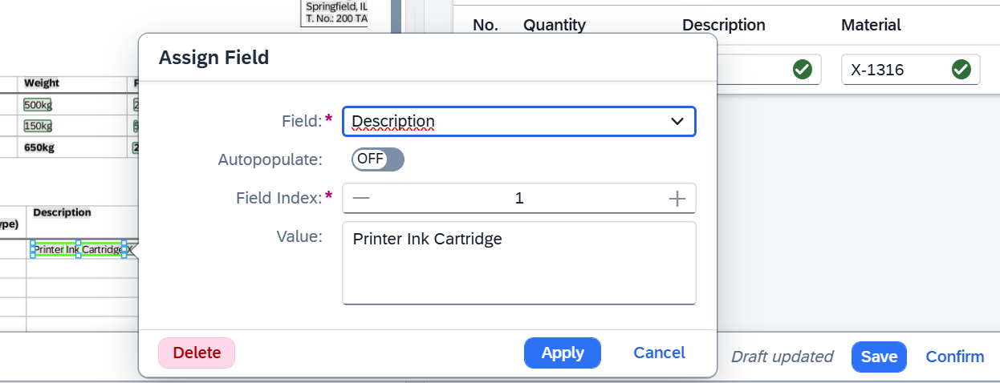
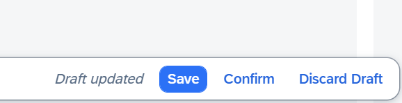

# Exercise 6: Improve Extraction Accuracy with Instant Learning

In the previous exercises, some extracted information was incorrect and required manual correction. To avoid repeating these corrections, the system can learn from them using the **Instant Learning** feature.
This exercise explains how to enable Instant Learning and train the system through feedback.

## Step 1 - Activate Instant Learning

1. Open the **Settings** menu and select **Manage Configuration**.
 
  
2. In the configuration screen, open the **Learning** section, set **Instant Learning** to **Active**, and click **Save**.
 

## Step 2 - Train the System with Corrections

1. Open the **Bill of Lading** worklist from the previous exercise.
If documents remain in the **Review Needed** state, select one of them. If none are available, upload a new document and wait until it reaches the **Review Needed** state.
To observe the effect of Instant Learning on results, optionally upload the [BoL 2 French](../documents/Bill%20of%20Lading%202%20FR.pdf) document at this stage as well, in addition to the document you will correct for training. Later, you will re-upload the same file to compare results before and after learning.

3. Open a document that is in ***Review Needed*** state (make sure it is the [Bill of Lading 1.pdf](../documents/Bill%20of%20Lading%201.pdf))
 

4. Click ***Edit***
 

5. Review the extraction results and identify incorrect or missing fields.
For example, the **Package Count** may be empty but should be extracted from the **Grand Total** section.
 

7. Correct the field by clicking on the text in the document preview and then select the ***Package Count*** field and apply it.
 

8. Next go to the ***Carrier Information*** table and notice that the ***Material No*** and ***Description*** are not extracted as expected.
 

9. Correct both fields by selecting ***X-1316*** as ***Material No*** and ***Printer Ink Cartridge*** as ***Description***.
 

10. Once you are happy with the results, click on ***Confirm*** in the bottom right corner and confirm the dialog. Now you taught the model your first corrections, which will automatically be applied the next time you process a document with this schema.
 

## Step 3 - Verify Learning Results

1. Upload another document to see how the learning is automatically being applied. You can either upload the same file again or pick another Bill of Lading document from our samples. E.g. [BoL 2 French](../documents/Bill%20of%20Lading%202%20FR.pdf)

2. In this example, a French Bill of Lading was uploaded.
   Once processed, the extracted data reflects the applied learning. Previously incorrect fields now appear correctly extracted.
 

## Summary

You have learned how to improve the results with Instant Learning by correcting extraction errors and confirming documents. The system learns from your corrections and applies them automatically to future documents, enhancing extraction accuracy over time.
confidence levels. 
Continue to [Exercise 7](../ex7/README.md) to learn how to create workflows for document classification and type-specific extraction.